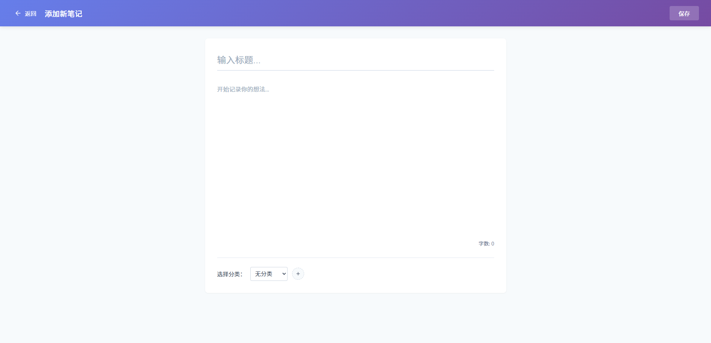

# 轻笔记应用

## 项目简介
这是一个基于Spring Boot和Vue.js的全栈笔记管理应用，提供完整的笔记管理功能，包括笔记的添加、编辑、查询、删除、分类管理、置顶、归档以及导出为Word文档等功能。系统采用前后端分离架构，具有良好的可扩展性和维护性。

## 技术栈

### 后端
- Spring Boot 2.7.18 - 核心后端框架
- Spring Security - 身份认证与授权
- MyBatis - ORM框架
- MySQL 8.0 - 关系型数据库
- Apache POI - Office文档生成库
- Maven - 项目管理与构建工具

### 前端
- Vue 3 - 前端框架
- Vue Router 4 - 路由管理
- Vite - 前端构建工具

## 项目结构
```
easyproject/
├── backend/          # 后端代码
│   ├── src/          # 源代码
│   ├── pom.xml       # Maven配置
│   └── run_maven.bat # Maven运行脚本
├── frontend/         # 前端代码
│   ├── src/          # 源代码
│   ├── package.json  # NPM配置
│   └── vite.config.js # Vite配置
├── start_backend.bat # 启动后端脚本
└── start_frontend.bat # 启动前端脚本
```

## 功能模块
1. **用户认证**：提供登录功能，基于Spring Security验证
2. **笔记管理**：
   - 笔记列表展示与搜索
   - 添加新笔记信息
   - 编辑现有笔记信息
   - 删除笔记
   - 置顶/取消置顶笔记
   - 归档/取消归档笔记
   - 导出笔记为Word文档
3. **分类管理**：管理笔记分类，支持多颜色区分

## 环境要求
- JDK 8+
- Node.js 14+
- MySQL 8.0+

## 启动方法

### 1. 环境准备
- 安装并启动MySQL 8.0+

### 2. 后端启动
1. 配置数据库连接：修改`backend/src/main/resources/application.properties`中的数据库连接信息
2. 运行启动脚本：
   ```
   双击运行 start_backend.bat
   或
   cd backend
   run_maven.bat
   ```
3. 后端服务将运行在 http://localhost:8088

### 3. 前端启动
1. 安装依赖：
   ```
   cd frontend
   npm install
   ```
2. 运行启动脚本：
   ```
   双击运行 start_frontend.bat
   或
   npm run dev
   ```
3. 前端服务将运行在 http://localhost:3000

## 项目配置
- 后端配置：`backend/src/main/resources/application.properties`
  - 数据库连接设置
  - 服务器端口配置
- 前端配置：`frontend/vite.config.js`
  - 开发服务器配置
  - 代理设置

## 使用说明
1. 访问前端页面：http://localhost:3000
2. 使用账号登录
3. 登录后可访问笔记管理页面，进行笔记信息的增删改查操作

## 界面预览
以下是轻笔记应用的主要界面预览：

### 用户登录页面


### 笔记管理首页


### 添加新笔记页面



## 注意事项
1. 确保在启动项目前，MySQL服务已正确启动